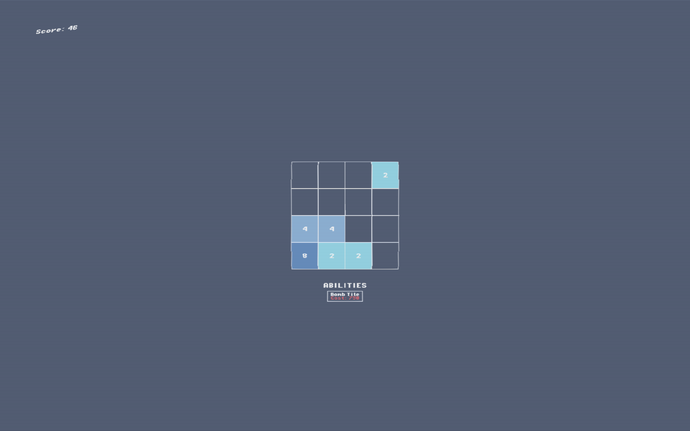
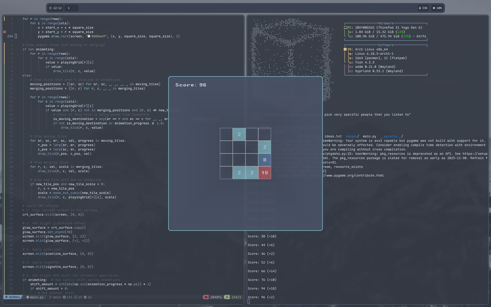
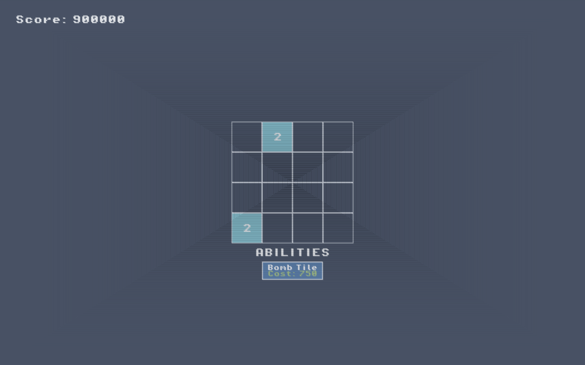

# 2048 rogue like using pygame. 

With the latest changes; the moderngl version of the game should run at a playable framerate.





## run:

if you wanna run make sure you update the NATIVE_WIDTH & NATIVE_HEIGHT variables to match your native resolution.

Debian/Ubuntu:

```
    sudo apt install python3

    sudo apt install python3-pip

    sudo apt install python3-pygame

    python3 main.py
```

windows:

```
    Download python: https://www.python.org/downloads/

    In command prompt: pip install pygame

    python main.py
```
