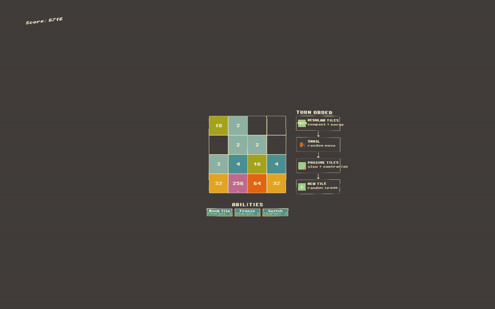

# 2048 rogue like using pygame.

With the latest changes; the moderngl version of the game should run at a playable framerate.




## Prerequisites

- Python 3.10+
- A C++ compiler (g++ on Linux, MSVC on Windows)
- CMake

Make sure you update the `NATIVE_WIDTH` & `NATIVE_HEIGHT` variables in `main.py` to match your native resolution.

## Linux

```bash
# Install system dependencies (Debian/Ubuntu)
sudo apt install python3 python3-pip python3-venv cmake g++

# Install system dependencies (Arch)
sudo pacman -S python python-pip cmake gcc

# Create venv and install Python dependencies
python3 -m venv venv
source venv/bin/activate
pip install pygame moderngl numpy pybind11 cmake

# Build the C++ engine
mkdir -p build && cd build
cmake ../engine -Dpybind11_DIR=$(python3 -m pybind11 --cmakedir)
make -j$(nproc)
cp game2048_engine*.so ../
cd ..

# Run
source venv/bin/activate
python3 main.py
```

## Windows

```powershell
# Install Python from https://www.python.org/downloads/
# Make sure "Add Python to PATH" is checked during install
# Install Visual Studio Build Tools from https://visualstudio.microsoft.com/visual-cpp-build-tools/
# (select "Desktop development with C++" workload)

# Create venv and install Python dependencies
python -m venv venv
venv\Scripts\activate
pip install pygame moderngl numpy pybind11 cmake

# Build the C++ engine
mkdir build
cd build
cmake ..\engine -Dpybind11_DIR=$(python -m pybind11 --cmakedir)
cmake --build . --config Release
copy Release\game2048_engine*.pyd ..
cd ..

# Run
venv\Scripts\activate
python main.py
```
