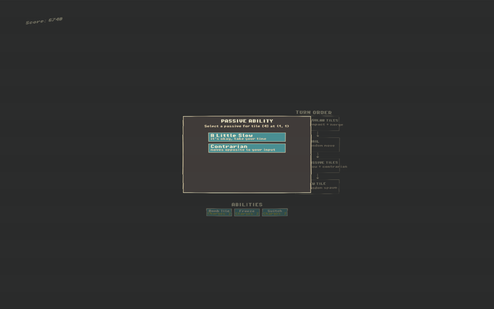
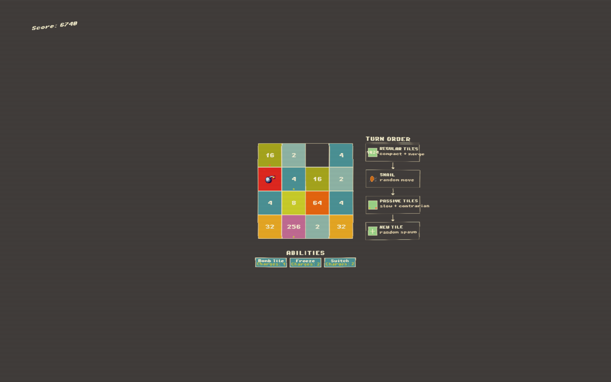
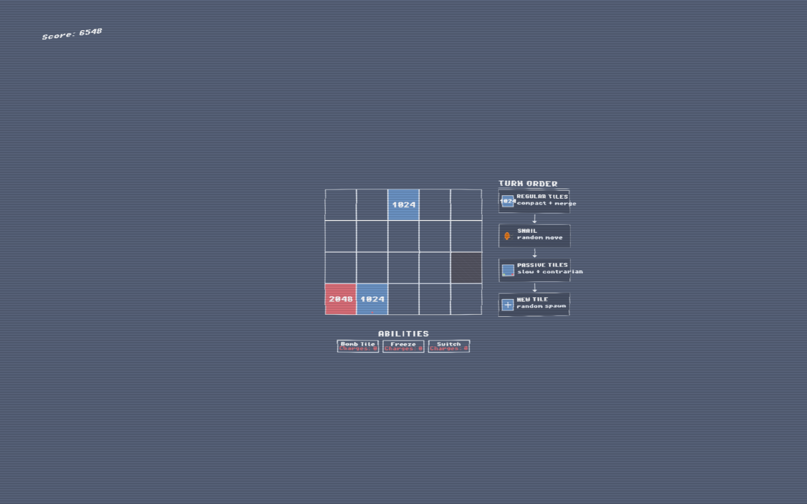

# 2048 rogue like using pygame.

With the latest changes; the moderngl version of the game should run at a playable framerate.





## Prerequisites

- Python 3.10+
- A C++ compiler (g++ on Linux, MSVC on Windows)
- CMake

Make sure you update the `NATIVE_WIDTH` & `NATIVE_HEIGHT` variables in `src/main.py` to match your native resolution.

## Linux

```bash
# Install system dependencies (Debian/Ubuntu)
sudo apt install python3 python3-pip python3-venv cmake g++

# Install system dependencies (Arch)
sudo pacman -S python python-pip cmake gcc

# Create venv and install Python dependencies
python3 -m venv src/venv
src/venv/bin/pip install pygame moderngl numpy pybind11 cmake

# Build the C++ engine
bash compile.sh

# Run
src/venv/bin/python3 src/main.py
```

> **fish shell:** `source src/venv/bin/activate` won't work — use `source src/venv/bin/activate.fish` or just invoke `src/venv/bin/python3` directly as shown above.

## Windows

Install prerequisites:
- [Python 3.10+](https://www.python.org/downloads/) — check "Add Python to PATH" during install
- [Visual Studio Build Tools](https://visualstudio.microsoft.com/visual-cpp-build-tools/) — select the "Desktop development with C++" workload
- [CMake](https://cmake.org/download/)

```bat
REM Create venv and install Python dependencies
python -m venv src\venv
src\venv\Scripts\activate
pip install pygame-ce moderngl numpy pybind11 cmake

REM Build the C++ engine
compile.bat

REM Run
src\venv\Scripts\activate
python src\main.py
```

[^1]:
    Kudos to @SheviTGP for his help testing and improving Windows instructions.
[^1]
